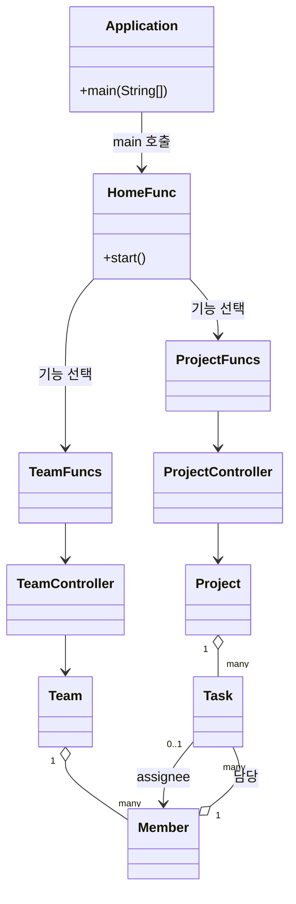
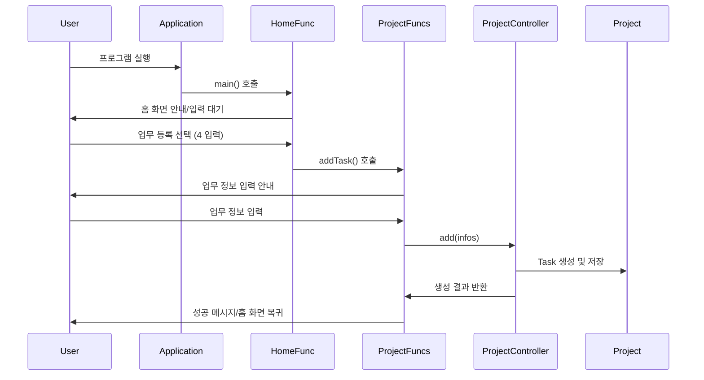
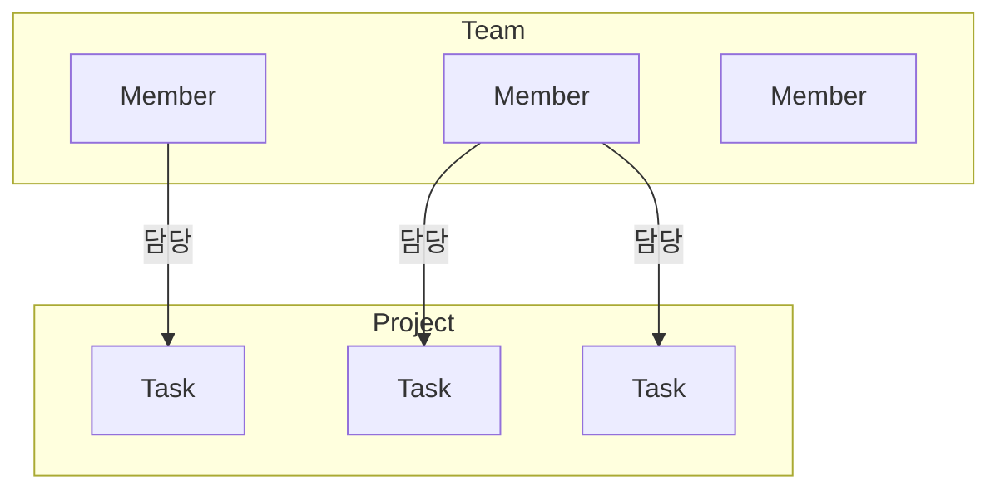

# Mini 프로젝트

## 개요
Mini 프로젝트는 팀/업무 관리를 위한 콘솔 기반 자바 프로그램입니다.  
팀원 초대, 업무 등록/수정/조회, 팀원 정보 관리 등 기본적인 프로젝트 관리 기능을 제공합니다.


## 주요 기능

- **홈 화면**
    - 프로젝트 현황(업무 상태별 개수, 분업 현황) 및 최근 활동 로그 표시
    - 기능 선택: 팀원 초대/정보수정/조회, 업무 등록/정보수정/조회, 종료

- **팀원 관리**
    - 팀원 초대: 이름, 권한 입력으로 신규 팀원 추가
    - 팀원 정보 수정: 이름, 권한, 담당 업무 수정
    - 팀원 조회: 조건(권한/업무 보유 여부)별 팀원 목록 확인 및 필터링
    - 팀원 해임: 팀원 ID 입력으로 해당 팀원 삭제

- **업무 관리**
    - 업무 등록: 업무명, 유형, 담당자, 마감일 입력으로 신규 업무 추가
    - 업무 정보 수정: 업무명, 상태, 담당자, 마감일 변경 및 업무 삭제
    - 업무 조회: 조건(유형/상태/담당자ID)별 업무 목록 확인 및 필터링

- **활동 로그**
    - 주요 작업(등록/수정/삭제/초대/해임 등) 내역이 최근 5건까지 표시됨


## 실행 방법

1. JDK 17+ 환경에서 프로젝트를 빌드합니다.
2. `src/main/Application.java`의 main 메서드를 실행합니다.
3. 콘솔에 표시되는 안내에 따라 숫자를 입력해 기능을 선택합니다.


## 폴더 구조

```
src/
├── configs/
│   ├── message/
│   │   ├── Ingredient.java         # 메시지 템플릿/포맷 (업무/팀원/로그 등)
│   │   ├── SystemMessage.java      # 시스템 안내 메시지 포맷
│   │   └── UIMessage.java          # UI 안내 메시지 포맷
│   ├── project/
│   │   ├── TaskStatus.java         # 업무 상태 Enum
│   │   └── TaskType.java           # 업무 유형 Enum
│   ├── team/
│   │   └── Authority.java          # 팀원 권한 Enum
│   └── validation/
│       ├── FailureReason.java      # 검증 실패 메시지
│       └── RegEx.java              # 입력값 검증 정규식
│ 
├── controller/
│   ├── controllers/
│   │   ├── ProjectController.java  # 업무(Task) CRUD 컨트롤러
│   │   └── TeamController.java     # 팀원(Member) CRUD 컨트롤러
│   ├── Adder.java                  # 생성(Create) 인터페이스
│   ├── Getter.java                 # 조회(Read) 인터페이스
│   ├── Updater.java                # 수정(Update) 인터페이스
│   ├── Remover.java                # 삭제(Delete) 인터페이스
│   └── Controller.java             # 컨트롤러 추상 클래스
│ 
├── functions/
│   ├── HomeFunc.java               # 홈/메인 화면 기능
│   ├── project/
│   │   └── ProjectFuncs.java       # 업무 관련 기능 (등록/조회/수정)
│   └── team/
│       └── TeamFuncs.java          # 팀원 관련 기능 (초대/조회/수정/해임)
│ 
├── managers/
│   ├── conversion/
│   │   ├── Converter.java                  # 변환 추상 클래스
│   │   ├── StringAuthorityConverter.java   # String <-> Authority 변환
│   │   ├── StringDateConverter.java        # String <-> LocalDate 변환
│   │   ├── StringDateTimeConverter.java    # String <-> LocalDateTime 변환
│   │   ├── StringTaskStatusConverter.java  # String <-> TaskStatus 변환
│   │   └── StringTaskTypeConverter.java    # String <-> TaskType 변환
│   ├── messageBuild/
│   │   ├── MessageBuilder.java             # 메시지 빌더 추상 클래스
│   │   ├── SystemMessageBuilder.java       # 시스템 메시지 빌더
│   │   ├── UIMessageBuilder.java           # UI 메시지 빌더
│   │   └── ingredient/
│   │       ├── MemberListMessageBuilder.java   # 팀원 목록 메시지 빌더
│   │       ├── OverviewMessageBuilder.java     # 프로젝트 현황 메시지 빌더
│   │       └── TaskListMessageBuilder.java     # 업무 목록 메시지 빌더
│   ├── validation/
│   │   ├── AddTaskValidator.java           # 업무등록 입력 검증
│   │   ├── BrowseMembersValidator.java     # 팀원조회 입력 검증
│   │   ├── BrowseTasksValidator.java       # 업무조회 입력 검증
│   │   ├── InviteMemberValidator.java      # 팀원초대 입력 검증
│   │   ├── RemoveMembersValidator.java     # 팀원해임 입력 검증
│   │   ├── UpdateMemberInfoValidator.java  # 팀원수정 입력 검증
│   │   ├── UpdateTaskInfoValidator.java    # 업무수정 입력 검증
│   │   └── Validator.java                  # 검증 추상 클래스
│   ├── ConverterManager.java               # 변환 매니저
│   ├── MessageBuilderManager.java          # 메시지 빌더 매니저
│   └── ValidatorManager.java               # 검증 매니저
│   └── Manager.java                        # 매니저 추상 클래스
│ 
├── model/
│   ├── project/
│   │   ├── Project.java                # 프로젝트 (업무 관리 싱글턴)
│   │   └── Task.java                   # 업무(Task) 데이터 클래스
│   └── team/
│       ├── Member.java                 # 팀원(Member) 데이터 클래스
│       └── Team.java                   # 팀(팀원 관리 싱글턴)
│ 
├── utils/
│   ├── console/
│   │   ├── InputReader.java            # 콘솔 입력 유틸리티
│   │   └── Viewer.java                 # 콘솔 출력/화면 정리 유틸리티
│   ├── FuncTest.java                   # 테스트용 더미 데이터 생성/확인
│   ├── Graph.java                      # 분업현황 그래프 생성
│   ├── LogRecorder.java                # 활동 로그 기록/조회
│   └── Pair.java                       # key-value 자료구조
└── main/
    └── Application.java                # 프로그램 실행 entry point
```

### 폴더별 주요 역할
- **configs:** 설정 및 Enum, 각종 메시지/포맷 정의와 입력 검증 관련 자료 보관.
- **controller:** 데이터 CRUD 담당. 각 도메인별 컨트롤러와 CRUD 인터페이스로 역할 분리.
- **functions:** 실제 화면/기능 단위 로직을 담당. 각 메뉴별로 사용자의 입력, 검증, 컨트롤러 호출까지 담당.
- **managers:** 변환, 메시지 제작, 검증 등 공통 관리 기능을 제공. 각 기능별 클래스를 일괄 관리하는 매니저 클래스 포함.
- **model:** 도메인 객체(업무, 팀원, 프로젝트 등)와 싱글턴 패턴으로 전체 데이터 관리.
- **utils:** 입출력, 테스트, 그래프, 로그 등 보조 유틸리티 클래스.
- **main:** 프로그램 실행 시작점.

### 참고
- 각 기능(업무, 팀원)은 "functions"에서 화면 로직, "controller"에서 데이터 조작, "model"에서 데이터 객체 정의로 분리 운영됩니다.
- 메시지, 변환, 검증 등은 "managers"에서 일괄 관리하며, 신규 기능 추가 시 해당 폴더에 클래스를 확장하면 됩니다.


## 다이어그램

### 1. 전체 구조 (클래스 관계)



### 2. 주요 기능 흐름 (예: 업무 등록)



### 3. 데이터 흐름 (팀원/업무)




## 사용 예시

### 홈 화면
```
< 프로젝트 개요 > - - - - - - - - - - - - - - - - - - - - - - - - - - - - - - - - - - - - -

[업무상태] 완료 7 | 진행 4 | 대기 4 | 전체 15
[분업현황] ■■■■■■□□□□ | 60% ( ■ = 담당업무 보유 팀원 | □ = 담당업무 미보유 팀원 )

< 최근 활동 > - - - - - - - - - - - - - - - - - - - - - - - - - - - - - - - - - - - - - - -

기록된 활동이 없습니다!

< System > ~ ~ ~ ~ ~ ~ ~ ~ ~ ~ ~ ~ ~ ~ ~ ~ ~ ~ ~ ~ ~ ~ ~ ~ ~ ~ ~ ~ ~ ~ ~ ~ ~ ~ ~ ~ ~ ~ ~ ~

알맞은 숫자를 입력해 기능을 선택해주세요. 0 입력 시 프로그램을 종료합니다.
1. 팀원초대 | 2. 팀원정보수정 | 3. 팀원조회 | 4. 업무등록 | 5. 업무정보수정 | 6. 업무조회

~ ~ ~ ~ ~ ~ ~ ~ ~ ~ ~ ~ ~ ~ ~ ~ ~ ~ ~ ~ ~ ~ ~ ~ ~ ~ ~ ~ ~ ~ ~ ~ ~ ~ ~ ~ ~ ~ ~ ~ ~ ~ ~ ~ ~
입력)
```

### 팀원 초대 화면
```
< 팀원 초대 > - - - - - - - - - - - - - - - - - - - - - - - - - - - - - - - - - - - - - - -

초대할 팀원의 정보를 아래와 같이 입력해주세요.

팀원명 / 권한

[입력양식]
- 팀원명 : 4 글자 이하의 한국어
- 권한 : 1, 2, 3 중 하나 택 ( 1=Admin / 2=Member / 3=Viewer )

< System > ~ ~ ~ ~ ~ ~ ~ ~ ~ ~ ~ ~ ~ ~ ~ ~ ~ ~ ~ ~ ~ ~ ~ ~ ~ ~ ~ ~ ~ ~ ~ ~ ~ ~ ~ ~ ~ ~ ~ ~

요구 양식에 맞춰 등록할 정보를 입력해주세요.
기능 선택으로 돌아가시려면 486 을 입력해주세요.

~ ~ ~ ~ ~ ~ ~ ~ ~ ~ ~ ~ ~ ~ ~ ~ ~ ~ ~ ~ ~ ~ ~ ~ ~ ~ ~ ~ ~ ~ ~ ~ ~ ~ ~ ~ ~ ~ ~ ~ ~ ~ ~ ~ ~
입력)
```

### 업무 등록 화면
```
< 업무 등록 > - - - - - - - - - - - - - - - - - - - - - - - - - - - - - - - - - - - - - - -

등록할 업무의 정보를 아래와 같이 입력해주세요.
업무명과 유형은 필수 항목이며, 보류하실 항목엔 @ 를 입력해주세요.

업무명 / 유형 / 담당자ID? / 마감일?

[입력양식]
- 업무명 : 15 글자 이하의 한국어+영어+숫자
- 유형 : 1, 2, 3, 4 중 하나 택 ( 1=기획 / 2=개발 / 3=디버그 / 4= 기타 )
- 담당자ID : 영소문자 "m"과 100 미만의 숫자의 조합 ( 예: m02, m33, ... )
- 마감일 : yyyymmdd 형태의 숫자, (첫 y는 2이상, mm은 01~12, dd는 01~31)

< System > ~ ~ ~ ~ ~ ~ ~ ~ ~ ~ ~ ~ ~ ~ ~ ~ ~ ~ ~ ~ ~ ~ ~ ~ ~ ~ ~ ~ ~ ~ ~ ~ ~ ~ ~ ~ ~ ~ ~ ~

요구 양식에 맞춰 등록할 정보를 입력해주세요.
기능 선택으로 돌아가시려면 486 을 입력해주세요.

~ ~ ~ ~ ~ ~ ~ ~ ~ ~ ~ ~ ~ ~ ~ ~ ~ ~ ~ ~ ~ ~ ~ ~ ~ ~ ~ ~ ~ ~ ~ ~ ~ ~ ~ ~ ~ ~ ~ ~ ~ ~ ~ ~ ~
입력) 
```


## 개발 및 유지보수

- 각 주요 기능별 클래스와 Validator, Converter, MessageBuilder 등은 확장 가능하게 분리되어 있습니다.
- 테스트용 더미 데이터는 `utils.FuncTest`에 포함되어 있으며, main 실행 시 자동 등록됩니다.

